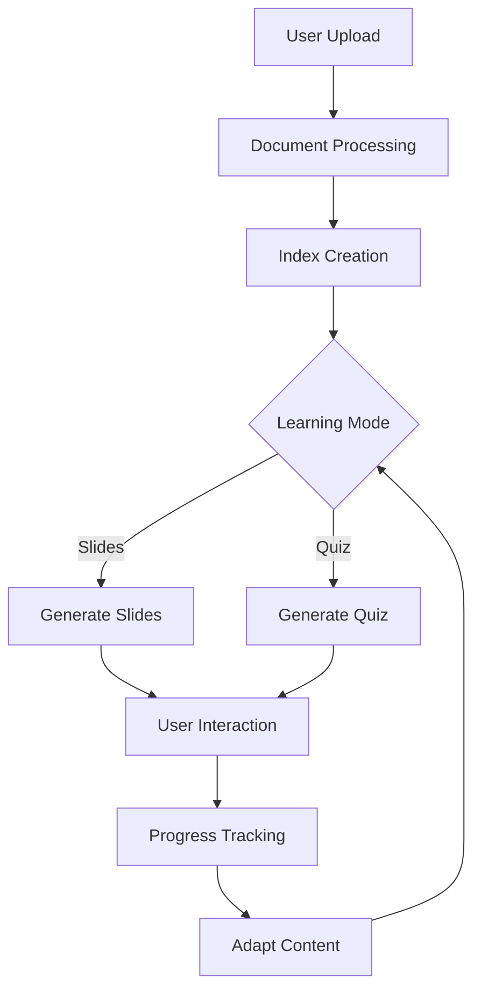

# Personalized Intelligent Tutoring System (PITS)

This repo is based on the book [Building Data-Driven Applications with LlamaIndex](https://www.packtpub.com/en-us/product/building-data-driven-applications-with-llamaindex-9781835089507) ([repo](https://github.com/PacktPublishing/Building-Data-Driven-Applications-with-LlamaIndex)) with several improvements and additional features.

## Introduction

PITS is a personalized intelligent tutoring system that uses LlamaIndex to generate interactive learning materials (slides and quizzes) based on user-provided study materials. The system adapts to the user's learning pace and preferences, providing a customized learning experience.

## Installation

1. Install Python requirements:
```bash
pip install -r requirements.txt
```

2. Install spaCy:
```bash
pip install -U pip setuptools wheel
pip install -U spacy
python -m spacy download en_core_web_sm
```

## System Components

### Core Files
- `app.py` - Main streamlit application entry point that handles routing and web interface
- `global_settings.py` - Global configuration settings and constants
- `model_settings.py` - LLM model configuration and settings
- `logging_functions.py` - Logging utilities for debugging and monitoring

### Document Processing
- `document_uploader.py` - Handles document upload and initial processing
- `index_builder.py` - Creates and manages LlamaIndex indices from uploaded documents
- `training_material_builder.py` - Generates learning materials from processed documents

### Learning Interface
- `slides.py` - Generates and manages presentation slides
- `quiz_builder.py` - Creates personalized quizzes based on content
- `quiz_UI.py` - User interface for quiz interactions
- `training_UI.py` - Main training interface components

### Session Management
- `session_functions.py` - Handles user session management and progress tracking
- `conversation_engine.py` - Manages interactive conversations with the LLM
- `user_onboarding.py` - Handles new user setup and preferences

## Application Flow

### Example Usage Flow:
1. User uploads study materials (PDF, text, etc.)
2. System processes and indexes the content
3. User selects learning mode (slides or quiz)
4. System generates personalized content
5. User interacts with materials and receives feedback
6. Progress is tracked and future content is adapted

### Flow Diagram



## Features
- Document upload and processing
- Automatic slide generation
- Interactive quiz creation
- Progress tracking
- Adaptive learning paths
- Conversation-based learning
- Session persistence

## Technical Details

### Document Processing
The system supports various document formats including:
- PDF
- Text files
- Word documents
- Markdown

### LLM Integration
- Uses LlamaIndex for document processing
- Configurable LLM providers
- Optimized context handling
- Semantic search capabilities

### Storage
- Session data persistence
- Progress tracking
- User preferences storage

## Future Enhancements
- [ ] Enhanced slide visualization in UI
- [ ] Add the support for links as a source of materials
- [ ] Add search functionality to find related materials like blogs, videos, etc.
- [ ] Additional model provider options
- [ ] Improved session resumption
- [ ] Multiple learning path support
- [ ] Enhanced progress analytics
- [ ] Collaborative learning features
